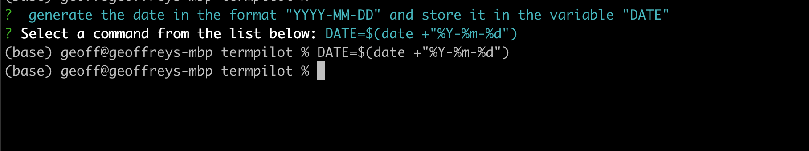
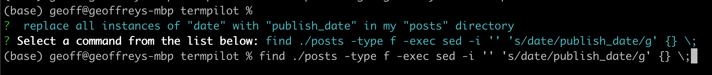

*The future is already here – it's just not evenly distributed.* - William Gibson

TLDR; You can skip to the "Introducing TermPilot" section if you're not interested in any background or inspiration.

## Background - Copilot 
I've been using and enjoying Copilot. For me, it's value is undeniable. I love solving problems, but not so much the spending time on tedious implementation details. Copilot excels in situations where you know what you WOULD code, but would rather just press a button and have that code autogenerated than type it out yourself. Here's a concrete example from some code "I" wrote recently (more below).

```TypeScript
    // remove empty strings
    split = split.filter((s) => s.length > 0)

    // remove any numbers followed by a period from the beginning
    split = split.map((s) => s.replace(/^\d+\.\s*/, ''))

    // remove any spaces from the beginning
    split = split.map((s) => s.replace(/^\s+/, ''))    
```

I wrote the comments myself. I actually enjoy stubbing out what I'm going to code using comments before I code it. It let's me convince myself that I have a solid "plan" before I start, and it serves as good documentation later. The actual code here was filled in by Copilot, I might have nudged in on the first line with a "split = split.filter" as you sometimes have to do this with Copilot. Once generated, it was trivial to look at it and verify it was what I was looking for. 

## Inspiration

Last week, [I migrated](https://gflarity.deno.dev/2023-03-08-I-Switched-To-Deno) this very blog over to Deno and deno.land/x/blog. I was putting together the README, and these lines in particular had me wishing for something like Copilot for the Linux/Unix terminal:

```Bash
DATE=`date +%Y-%m-%d`
TITLE="Your Title"
echo -e "---\npublish_date: $DATE\ntitle: $TITLE\n---\n" >> ./posts/${DATE}_${TITLE// /-}.md
```

I knew what I wanted, but I had to google to get the above, and there as more than a bit of trial and error involved.

## Introducing TermPilot

At the time I thought, how great would be if there was a tool, similar to [fzf](https://github.com/junegunn/fzf), that you could use to "search" for the right command to run in your shell. 

So I made it!

[Introducing TermPilot](https://github.com/gflarity/termpilot):



Using TermPilot was significantly easier than Googling it. 

During my blog migration, another thing I had to do was replace all instances of "date" with "publish_date" in my "posts" directory. Let's see how TermPilot does, I'll just cut and paste part of the sentence above, describing what I want:



This is not the command that I came up with myself, but it works!  It was orders of magnitude faster to produce with TermPilot (and the OpenAI Davinci Completion Model). I really don't care to memorize any of shell commands above, nor do I need to cobble them together after a bit of googling anymore. TermPilot will do this for me now. I've [open sourced this tool](https://github.com/gflarity/termpilot), so now you don't either!

## What You Need

You'll need an OpenAI API Token. But each query costs a fraction of penny. So far, it's cost me $0.15 for all the testing and usage around TermPilot so far this month. I'd guess that regular usage of term pilot should cost me less than $0.25 a month. Everything else is free software.

## Call For Contributions

Finally, I'm hoping folks will contribute and we can make this tool even better together. But even given where it's at right now, it's valuable to me. One of the most practical/valuable things I've ever put together, and it's currently 52 lines.

